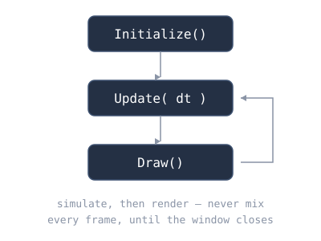

# Chapter 2: C#, the game loop, and a moving square

> Build status: **[unverified]** — written against Nez @ `3f8cc40` and FNA @
> `24031e5b`, not compiled. Treat failures as chapter bugs and report them.

## Where we are

Chapter 1 gave us a window and nothing in it. This chapter puts the first
thing on screen — a square you steer with the arrow keys — and uses it to
teach the two ideas everything else rests on: the XNA game loop and the C#
type system as a TypeScript/Go engineer meets it.

## Concepts

### The game loop

An XNA-family game is a loop with three phases, driven by `Game.Run()`:

1. **`Initialize()`** — once. Create resources, set the first scene.
2. **`Update(GameTime)`** — every frame. Read input, simulate the world.
   Never draw here.
3. **`Draw(GameTime)`** — every frame, after `Update`. Render the world.
   Never simulate here (no moving things, no reading fresh input for logic).

One Nez-specific fact, straight from `Core`'s constructor source: Nez sets
`IsFixedTimeStep = false`. XNA's default is a *fixed* 60 Hz timestep; Nez
turns it off, so frames take however long they take. That is why movement
is scaled by **`Time.DeltaTime`** — a static *field* (not a property)
holding the seconds elapsed since the previous frame. `pos += vel * dt`
makes speed mean "pixels per second" on any hardware. 
**Frame-rate independence is mandatory:** Forget the `* dt` and your game runs at the monitor's refresh rate — 2.4x too fast on a 144 Hz display. Nez's variable timestep makes this a requirement, not a nicety.


`GameTime` (the parameter) carries the same timing plus total elapsed time;

we mostly ignore it and use `Time.DeltaTime`.




### C# for the TypeScript/Go engineer, part 1

**Structs are values; classes are references.** `Vector2` is a `struct` —
when you assign it, you get an independent *copy*. This is the single most
important C# fact for game code:

```csharp
var p = someEntity.Position; // Position returns a COPY of the Vector2
p.X += 1;                    // mutates the copy. The entity never moves.
```

Go has the same value semantics for structs, so this should feel familiar —
but C# *properties* make it sneaky: `Entity.Position` looks like a field and
behaves like a method call returning a copy. 
**The struct-copy gotcha:** `Entity.Position` looks like a field but returns a *copy* — mutating the copy moves nothing. Rule of thumb: read a struct property into a local, mutate the local, assign it back.


**Fields vs properties.** `Time.DeltaTime` is a `public static float` field;
`Entity.Position` is a property with a getter and setter. You cannot tell
by looking at use sites — check the declaration when it matters (a property
setter can run arbitrary code; `Position`'s setter notifies the transform
hierarchy).

**`const` vs `readonly`.** `const float MoveSpeed = 240f` is a compile-time
constant (implicitly static, only primitives). `readonly` fields are set
once at runtime (in the constructor) — that's what `_pixel` wants, since a
`Texture2D` can't exist at compile time.

**Namespaces collide; `using` disambiguates.** This chapter needs
`Microsoft.Xna.Framework.Input` (for `Keys`) *and* Nez's `Input` class.
Both live in namespaces with "Input" in the name. `using` imports are
per-file and order-independent — when two imported namespaces contain the
same type name, you qualify it explicitly. (Later: `using XnaInput =
Microsoft.Xna.Framework.Input;` aliasing.)

**`MathHelper.Clamp`** is XNA's utility class for the obvious math —
`Clamp`, `Lerp`, `Min`, `Max`. You will use it constantly.

### Drawing without sprites

XNA has no rectangle primitive. The standard trick: create a 1×1 white
`Texture2D` once, then draw it stretched over any `Rectangle` with any
tint. `Graphics.Instance.Batcher` is Nez's sprite batcher — `Begin()`,
issue `Draw` calls, `End()`. Our scene is still empty, so we draw *after*
`base.Draw(gameTime)` renders it.

## Minimal snippets

The loop skeleton (not the full file — assemble it yourself):

```csharp
protected override void Update(GameTime gameTime)
{
    if (Input.IsKeyDown(Keys.Left)) { /* ... */ }
    base.Update(gameTime);
}
```

`Input` here is `Nez.Input`: `IsKeyDown` (held), `IsKeyPressed` (this frame
only), `IsKeyReleased` (this frame only). The pressed/released variants
will matter for jumping in Chapter 4.

The struct-copy gotcha, demonstrated:

```csharp
Vector2 a = new Vector2(1, 2);
Vector2 b = a;   // independent copy
b.X = 99;        // a.X is still 1
```

## Exercises

### 1. Make the square yours

Change the square's color, size, and speed. Re-run after each change and
confirm what you see matches what you expected.

- *Nudge:* all three live in `SpirefallGame` as a field or `const`.
- *Bigger hint:* color is the last argument to `batcher.Draw`; size is
  `SquareSize`; speed is `MoveSpeed`.
- *Near-solution:* `Color.CornflowerBlue` square of 64px at 480 px/s is three
  one-line edits.

### 2. Fix diagonal speed

Holding Up+Right moves the square √2 ≈ 1.41× faster than a single
direction, because the combined vector has length √2. Normalize the input
vector when it is non-zero.

- *Nudge:* `Vector2.Normalize()` exists — but it mutates nothing; check
  whether it returns a new vector or normalizes in place.
- *Bigger hint:* `Vector2.Normalize(move)` is the static form returning a
  normalized copy. Guard with `if (move != Vector2.Zero)`.
- *Near-solution:* after gathering input, `if (move.LengthSquared() > 0)
  move = Vector2.Normalize(move);` — `LengthSquared` avoids the sqrt.

### 3. Sprint on Shift

Holding either Shift key doubles the speed.

- *Nudge:* `Keys.LeftShift` and `Keys.RightShift`.
- *Bigger hint:* compute `var speed = MoveSpeed;` then conditionally double
  it before scaling by `dt`.
- *Near-solution:* `if (Input.IsKeyDown(Keys.LeftShift) ||
  Input.IsKeyDown(Keys.RightShift)) speed *= 2;`

### 4. Wrap around the screen edges

Replace clamping with wrap-around: leaving the right edge enters from the
left, and so on.

- *Nudge:* four `if` statements, one per edge.
- *Bigger hint:* when `_squarePos.X > 1280`, set it to `-SquareSize`
  (fully off-screen before re-entering looks better than popping).
- *Near-solution:* mirror the condition for all four edges; delete the
  `MathHelper.Clamp` lines.

### 5. A trailer square

Add a second, smaller square that chases the first: each frame it moves
toward the leader's position at a fixed speed, but never overshoots.

- *Nudge:* direction = `leader - trailer`, normalized, times speed times dt.
- *Bigger hint:* compute the distance first; the step is
  `Math.Min(chaseSpeed * dt, distance)` so it stops exactly on arrival.
- *Near-solution:* `var to = _squarePos - _trailerPos; var d = to.Length();
  if (d > 0.5f) _trailerPos += to / d * Math.Min(180f * dt, d);`

### 6. Break it: drop `* Time.DeltaTime`

Remove the `dt` scaling, run, and describe what happens. Then put it back.

- *Nudge:* the square now moves `MoveSpeed` pixels *per frame*.
- *Bigger hint:* on a 60 Hz display that's 14,400 px/s. If your monitor is
  120/144 Hz, even faster.
- *Near-solution:* the takeaway to write down: frame-rate independence is
  not a nicety, it's the difference between a game and a strobe light —
  and Nez's variable timestep makes it mandatory, not optional.

### 7. Log the position once per second

Use `Nez.Debug.Log` to print the square's position, but only about once per
second — not every frame (60 lines/second is unreadable).

- *Nudge:* accumulate `Time.DeltaTime` in a field; when it exceeds 1,
  log and reset.
- *Bigger hint:* `Debug.Log("pos: {0}", _squarePos);` — format-string style,
  like `string.Format`.
- *Near-solution:* `_logTimer += Time.DeltaTime; if (_logTimer >= 1f)
  { _logTimer = 0; Debug.Log("square: {0}", _squarePos); }`

## Checkpoint

Run: `dotnet run` from `Spirefall/`.

You should see: the cornflower-blue window, now with an orange-red square
(or your Exercise 1 color) that glides — not jerks — under the arrow keys,
stopping dead at the window edges (or wrapping, after Exercise 4). Diagonal
movement feels the same speed as straight movement (after Exercise 2).

Done means: exercises 1–4 complete; 5–7 attempted. Your `SpirefallGame.cs`
now owns `Update`/`Draw` overrides — Chapter 3 will take them away again,
on purpose.

## Next

Chapter 3 introduces Nez's Scene/Entity/Component model and pixel-perfect
rendering, and replaces the hand-drawn square with a real sprite entity.
