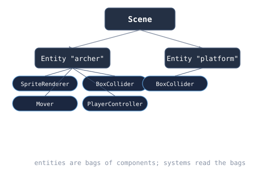

# Chapter 3: Scene, Entity, Component, and pixel-perfect rendering

> Build status: **[unverified]** — written against Nez @ `3f8cc40`, not compiled.

## Where we are

Chapter 2's square was drawn by hand in `SpirefallGame.Draw` — fine for one
square, unworkable for a game. This chapter replaces it with Nez's
Scene/Entity/Component model, renders our first sprite, and sets up
pixel-perfect scaling. The `Update`/`Draw` overrides from Chapter 2 are
deleted on purpose: from here on, behavior lives in components.

**What changed from Chapter 2:** `SpirefallGame` loses its `Update`/`Draw`
overrides, the `_pixel` texture, and the square fields — it is back to the
Chapter 1 shape, except it now assigns `Scene = new ArenaScene()`. New files:
`ArenaScene.cs`, `Archer.cs`.

## Concepts

### Scene / Entity / Component

- A **Scene** is a level, menu, or any self-contained part of the game. It
  owns a list of entities, a camera, and a content manager; `Core.Scene`
  selects which one simulates and renders.
- An **Entity** is a thing in the scene. It has a `Position` (and rotation,
  scale via its transform) and a bag of components. Entities do almost
  nothing themselves — `CreateEntity("archer", position)` then
  `AddComponent(...)`.
- A **Component** is a reusable behavior or renderer: `SpriteRenderer`,
  `BoxCollider`, and everything you will write from Chapter 4 on. Two
  lifecycle facts matter now:
  - `OnAddedToEntity()` runs when the component joins an entity — cache
    references here, never in the constructor (the `Entity` property isn't
    set yet in the constructor).
  - `Update()` runs each frame only for components implementing
    `IUpdatable`.


**Update needs IUpdatable:** A component's `Update()` runs each frame **only if the component implements `IUpdatable`** — `class Player : Component, IUpdatable` with `void IUpdatable.Update()`. This surprises everyone once.




### Pixel-perfect rendering

Nez renders the scene to an internal canvas, then scales it to the window.
`SetDesignResolution(320, 180, SceneResolutionPolicy.ShowAllPixelPerfect)`
says: pretend the world is 320×180; scale by the largest *integer* that
fits, letterboxing the rest. Sprites are drawn 1 design-pixel → N screen
pixels with no filtering, so a 16×16 sprite is always crisp. Non-pixel-
perfect policies (e.g. `ShowAll`) allow fractional scales — fine for HD art,
blurry for pixel art. Our game is 16×16 tiles on a 320×180 stage.

### Sprites without assets

`new SpriteRenderer(texture)` renders one texture centered on its entity.
We have no art yet, so `Archer.CreatePlaceholderTexture()` builds a 16×16
`Texture2D` in code: allocate, fill a `Color[]`, `SetData`. When your real
`archer.png` arrives, only the factory method changes — the call site
(`new SpriteRenderer(Archer.CreatePlaceholderTexture())`) stays identical.
Design your code around that seam from the start.

### C# for the TS/Go engineer, part 2

- **`static class`**: a class that can never be instantiated — a namespace
  for functions. `Archer` is pure factory; making it static says so.
- **Arrays**: `new Color[256]` — fixed size, zero-initialized
  (`default(Color)` is transparent black, hence the fill loop).
- **XML doc comments** (`/// <summary>`): the IDE shows these on hover.
  Write them on every public type and method; future-you will thank
  present-you.
- **`Scene.Initialize()`** is virtual — scenes build their content there,
  after the scene is constructed but before the first frame.

## Minimal snippets

Creating an entity and giving it a sprite (the whole pattern):

```csharp
var archer = CreateEntity("archer", new Vector2(160, 90));
archer.AddComponent(new SpriteRenderer(someTexture));
```

Design resolution (from the Nez samples):

```csharp
SetDesignResolution(320, 180, SceneResolutionPolicy.ShowAllPixelPerfect);
```

A component that wants per-frame updates:

```csharp
public class Player : Component, IUpdatable
{
    void IUpdatable.Update() { /* runs every frame */ }
}
```

## Exercises

### 1. Change the stage size

Set the design resolution to 480×270 and re-run. How big is the archer
sprite now, in screen pixels, in the 1280×720 window?

- *Nudge:* 1280/480 = 2.67 — but the policy only allows integer scales.
- *Bigger hint:* the largest integer ≤ 2.67 is 2, so the canvas is 960×540
  centered with letterboxing.
- *Near-solution:* the 16px sprite renders at 32 screen pixels. Pixel-perfect
  always rounds *down* — a smaller stage means bigger pixels, never blurry
  ones.

### 2. Compare policies

Temporarily switch to `SceneResolutionPolicy.ShowAll` (no PixelPerfect),
resize the window to something odd like 1000×700, and look closely at the
sprite edges. Then switch back.

- *Nudge:* fractional scale = a sprite pixel covers a fractional screen pixel.
- *Bigger hint:* the GPU blends the boundary — that's the blur.
- *Near-solution:* this is *why* the book standardizes on pixel-perfect from
  Chapter 3: the decision is made once, and every later chapter inherits it.

### 3. Name and find

Give the sprite entity the name `"archer"` (it has it — verify) and, in
`ArenaScene.Initialize` *after* creating it, retrieve it with
`FindEntity("archer")` and `Debug.Log` its position.

- *Nudge:* `FindEntity` is a method on `Scene`; you're inside one, so call
  it directly.
- *Bigger hint:* `var found = FindEntity("archer"); Debug.Log("found: {0}",
  found.Position);`
- *Near-solution:* names are for humans and lookup; tags
  (`Entity.Tag` + `FindEntitiesByTag`) are the bulk-query equivalent you'll
  use for arrows and enemies later.

### 4. Break it: the orphan entity

Create an entity with `new Entity("ghost")` (instead of `CreateEntity`)
and add a `SpriteRenderer` to it. Run. Explain what you see and why.

- *Nudge:* who calls `Update` and renders components?
- *Bigger hint:* the *scene* drives its entity list. `new Entity()` never
  joins that list.
- *Near-solution:* nothing renders. `CreateEntity` both constructs *and*
  registers; a bare `new` is an orphan. Prefer `CreateEntity` always.

### 5. Draw your own placeholder

Edit `CreatePlaceholderTexture` to make the sprite look less like a blob:
different hood color, eyes (two light pixels), whatever you like. Keep it
16×16.

- *Nudge:* pixel index is `y * 16 + x`.
- *Bigger hint:* write a tiny local helper `void Px(int x, int y, Color c)`
  inside the method to avoid the index math everywhere.
- *Near-solution:* this throwaway art is load-bearing: every later chapter
  renders *this* while you learn, until your real assets drop in.

### 6. Where does `Update` live now?

`SpirefallGame` no longer overrides `Update`. In one or two sentences in
your notes, explain where per-frame logic will live from now on, and why
that's better than one giant `Update` in the game class.

- *Nudge:* think about what happens at 50 entities.
- *Bigger hint:* each component updates itself; the game class doesn't know
  or care how many exist.
- *Near-solution:* behavior is distributed into components implementing
  `IUpdatable` — the game class stays a thin bootstrapper, and behaviors
  become reusable across entities.

## Checkpoint

Run: `dotnet run` from `Spirefall/`.

You should see: the 1280×720 window letterboxed around a crisp 320×180
stage (4× integer scale), with your 16×16 archer sprite dead center —
64 screen pixels of placeholder art. Resize the window: the stage
re-scales in integer steps, never blurry.

Done means: exercises 1–4 complete; 5–6 attempted. `SpirefallGame.cs` is
thin again; `ArenaScene.cs` and `Archer.cs` exist.

## Next

Chapter 4 gives the archer a body that runs and jumps with Celeste-style
forgiveness: acceleration, variable jump height, coyote time, and jump
buffering.
