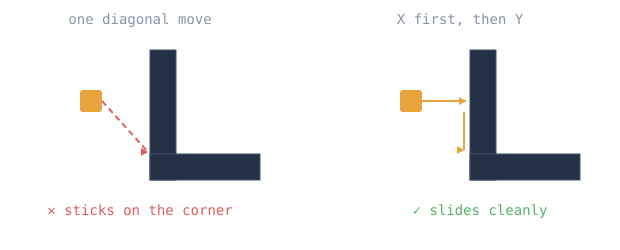

# Chapter 5: Collisions — colliders, the Mover, and the spatial hash

> Build status: **[unverified]** — written against Nez @ `3f8cc40`, not compiled.

## Where we are

The archer runs and jumps on an imaginary line. This chapter makes the world
solid: platforms as collider-only entities, the archer moved by Nez's
`Mover`, one axis at a time. The ground line, `FeetOffset`, and
`GroundLineY` are gone — grounding is now *detected*, not assumed.

**Changed:** `PlayerController.cs` (Mover-based, axis-separated movement;
`_grounded` from collision), `ArenaScene.cs` (colliders on the archer,
four platforms, a local-function helper).

## Concepts

### Colliders: shapes that mean "solid"

A **Collider** is a component holding a shape — `BoxCollider`, `CircleCollider`,
`PolygonCollider` — attached to an entity. `new BoxCollider(16, 16)` centers
a 16×16 box on the entity; `new BoxCollider(0, 0, w, h)` puts its top-left
at the entity's position. Nothing about a collider is visible or physical
by itself; it's *data* that the physics system queries. (Turn on
`Core.DebugRenderEnabled = true` to see them as red outlines — invaluable.)

### The spatial hash: broadphase

Every collider registers in a **SpatialHash**: a global grid that answers
"what's near this box?" without scanning every collider in the game. You
never touch it directly; the static `Physics` class (`Physics.Linecast`,
`Physics.OverlapRectangle`, …) is the public surface. One tuning knob:
`Physics.SpatialHashCellSize` (default 100px), set *before* creating the
scene — roughly your character's size is the usual advice. The in-game
debug console (`~` in DEBUG builds) has a `physics` command that draws the
grid.

### The Mover: swept, axis-separated movement

Teleporting a collider into a wall and asking "am I inside?" (overlap
resolution) tunnels at high speed and sticks on corners. Nez's `Mover`
instead *sweeps*: `Move(motion, out collisionResult)` advances the
collider along the motion vector and stops at first contact, returning
whether anything was hit.

We move **X first, then Y**, as two separate calls. Why: a diagonal move
that clips a platform corner has an ambiguous resolution — push out
horizontally or vertically? 
**Why axis separation:** A diagonal move that clips a platform corner has an ambiguous resolution — push out horizontally or vertically? Separated axes make each resolution unambiguous, which is what gives platformers clean corner slides instead of getting hung up.
 This is the same technique in Deepnight's
platformer tutorial, expressed through Nez's API.



`CollisionResult` (a struct) carries `Collider`, `Normal`,
`MinimumTranslationVector`, `Point`. This chapter only needs the bool; the
`Normal` becomes wall detection in Chapter 6. The `out _` discard says
"compute it, I don't need it."

### `OnAddedToEntity` and `GetComponent`

A component's constructor runs before it belongs to anything — `Entity` is
null there. `OnAddedToEntity()` is the right place to cache sibling
components (`_mover = Entity.GetComponent<Mover>()`), and to fail fast if
the scene assembled the entity wrong. Constructor: allocate self.
`OnAddedToEntity`: wire to neighbors.

### C# for the TS/Go engineer, part 3

- **`out` parameters**: `Move(motion, out collisionResult)` — the method
  *returns* extra values through `out` args. Callers must pass a variable
  (or `_` to discard). Think Go's multi-return, with the returns after
  the inputs.
- **Local functions**: `void CreatePlatform(...)` declared *inside*
  `Initialize`. They're real methods with closure capture, scoped to the
  enclosing method — ideal for assembly helpers you don't want on the
  class API.

## Minimal snippets

Giving an entity a body and moving it with collisions:

```csharp
entity.AddComponent(new BoxCollider(16, 16));
var mover = entity.AddComponent(new Mover());

// somewhere in Update:
if (mover.Move(new Vector2(dx, 0f), out _)) { /* hit a wall */ }
```

Querying the physics system directly (foreshadowing Chapters 11–12):

```csharp
var hit = Physics.Linecast(start, end);
if (hit.Collider != null) { /* line of sight blocked by hit.Collider.Entity */ }
```

## Exercises

### 1. Re-tune for the solid world

Collisions changed the feel (landing is now exact; edges are real). Replay
your Chapter 4 tuning exercise and adjust. Note what changed and why.

- *Nudge:* start from your written-down Chapter 4 numbers.
- *Bigger hint:* jump height is unchanged (same math), but *landing* feels
  different — exact vs clamped.
- *Near-solution:* most people raise `MoveSpeed` slightly once platforms
  give the eye reference points for speed.

### 2. See the invisible

Set `Core.DebugRenderEnabled = true` (in `SpirefallGame.Initialize`,
before the scene assignment — it's a static bool on `Core`) and re-run.

- *Nudge:* colliders draw as red outlines.
- *Bigger hint:* the archer's box is centered; the platforms' boxes start
  at their top-left. Confirm both visually.
- *Near-solution:* leave it on while doing the remaining exercises — every
  collision bug is obvious in red.

### 3. Break it: the diagonal move

Replace the two axis-separated `Move` calls with a single
`_mover.Move(new Vector2(Velocity.X * dt, Velocity.Y * dt), out _)`.
Jump at platform corners and describe what happens.

- *Nudge:* try landing exactly on a corner.
- *Bigger hint:* the single move resolves along one axis — sometimes the
  wrong one — and the archer hangs on corners.
- *Near-solution:* revert. Axis separation isn't a style choice; it's what
  makes corners slide instead of snag.

### 4. One-way platforms

Make the two floating platforms jump-through: solid when landing from
above, passable from below.

- *Nudge:* you control the Y move. A platform is one-way if you skip
  colliding with it while moving up.
- *Bigger hint:* `Mover` collides with everything; instead, tag one-way
  platforms (`platform.Tag = 1`) and… hmm, `Move` doesn't take a layer
  mask. Alternative: move Y in two phases — first `CalculateMovement`,
  check `collisionResult.Collider.Entity.Tag`, and if it's one-way and
  we're moving up, `ApplyMovement` the full delta instead.
- *Near-solution:* look at `Mover.CalculateMovement(ref motion, out result)`
  + `ApplyMovement(motion)`: calculate, inspect `result.Collider`, decide.
  This is exactly what those two methods are *for*.

### 5. The physics console

Run a DEBUG build, press `~`, type `physics`, and look at the spatial hash
grid. Then type `help` and skim the other commands.

- *Nudge:* `dotnet run` builds DEBUG by default.
- *Bigger hint:* the grid cells should be sparsely populated — four
  platforms and a player.
- *Near-solution:* file this away: when collision *performance* matters
  (hundreds of entities, Chapter 12+), this view is how you tune
  `SpatialHashCellSize`.

### 6. Bonk logging

`Debug.Log` a message when the archer bonks its head (Y-collision while
moving up).

- *Nudge:* your Y-move already returns whether it hit something — check
  the sign of the Y delta too.
- *Bigger hint:* if the Y move hit *and* the delta was negative (moving
  up), that's a head-bonk: `Debug.Log("bonk");`
- *Near-solution:* one line — but it proves you can distinguish landing
  from head-bonking, which Chapter 6's wall logic will need.

### 7. Design: moving platforms

In your notes (no code yet), sketch how you'd implement a platform that
slides left-right carrying the player. What breaks if the platform just
moves its own `Position`?

- *Nudge:* the player stands *on* it — who moves the player?
- *Bigger hint:* the platform must impart its delta to riders each frame.
- *Near-solution:* moving the platform's `Position` teleports its collider;
  the player needs the platform's per-frame delta added to their own move.
  (We'll implement this pattern for enemies' knockback later.)

## Checkpoint

Run: `dotnet run` (debug rendering on, from Exercise 2).

You should see: red-outlined colliders; the archer standing exactly on the
ground platform; jumps that land on the floating platforms and bonk under
them; clean slides along walls and around corners. Coyote time now fires
at real platform edges.

Done means: exercises 1–3 complete; 4–7 attempted. The ground line is
fully gone — no `GroundLineY` anywhere.

## Next

Chapter 6 completes the Celeste moveset: wall slide, wall jump, and dash,
driven by a tiny state machine.
