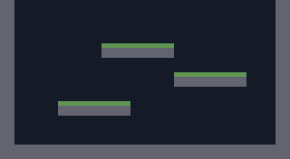

# Chapter 7: Real levels — tilemaps with Tiled

> Build status: **[unverified]** — written against Nez @ `3f8cc40`, not compiled.
> The `.tmx`/tileset pipeline in particular needs your build to confirm it.

## Where we are

Six chapters of hand-placed platforms got us a moveset with nowhere to go.
This chapter moves level geometry into the **Tiled** map editor: a real
`arena.tmx` with a tileset, rendered by `TiledMapRenderer` and collided
with via `TiledMapMover`. The platform entities are deleted — the map *is*
the level now.

**Changed:** `ArenaScene.cs` (loads the map, no more `CreatePlatform`),
`Spirefall.csproj` (copies `Content/` to the output). **New:**
`Content/Arena/arena.tmx`, `tiles.tsx`, `tiles.png` (generated for the
solution; you'll draw your own in the exercises). `PlayerController.cs`
is untouched — `TiledMapMover` *is* a `Mover`, so nothing downstream cares.

## Concepts

### Why tilemaps

Hand-placing platform entities works for a test room and collapses for a
level: hundreds of entities, no visual overview, every tweak a recompile.
A tilemap separates *authorship* (paint tiles in an editor) from *runtime*
(Nez renders the layer and collides against it). The `.tmx` file is data;

your code reads it. Level design becomes iteration, not programming.



### Tiled's model

- A **tileset** (`.tsx` + image) cuts a PNG into numbered tiles. Tile 0
  means "empty" — real tiles start at 1.
- A **tile layer** is a grid of tile numbers. Ours is 20×11 of 16px tiles
  on a 320×176 area (the 4px sliver at the bottom of our 180px stage is
  just background — maps don't have to fill the screen).
- **Object layers** hold named points/rects (spawn points, trigger zones)
  — Exercise 4.
- Layers are **CSV** inside the XML: human-readable, diffable, editable
  by hand in a pinch.

### Nez's Tiled pipeline

`Content.LoadTiledMap("Content/Arena/arena.tmx")` parses the map
(`Scene.Content` is a `NezContentManager`, scoped to the scene). Then:

- `new TiledMapRenderer(map, "Ground")` draws the named layer.
- `new TiledMapMover(map.GetLayer<TmxLayer>("Ground"))` collides against
  it. It subclasses `Mover`, so `PlayerController`'s
  `GetComponent<Mover>()` keeps working with zero changes — polymorphism
  doing its job.

The `.tmx` references `tiles.tsx`, which references `tiles.png`, all by
relative path. The csproj's `Content/**` copy rule puts the whole folder
next to the exe so those relative paths resolve at runtime. 
**Invisible tiles:** If the map loads but tiles render as nothing, the image path is the first suspect — the `.tmx` references the `.tsx`, which references the `.png`, all by relative path.


## Minimal snippets

Loading and wiring a map (the complete pattern):

```csharp
using Nez.Tiled;

var map = Content.LoadTiledMap("Content/Arena/arena.tmx");
tilemapEntity.AddComponent(new TiledMapRenderer(map, "Ground"));
player.AddComponent(new TiledMapMover(map.GetLayer<TmxLayer>("Ground")));
```

The content copy rule (standard MSBuild, in the `.csproj`):

```xml
<Content Include="Content\**\*.*">
  <CopyToOutputDirectory>PreserveNewest</CopyToOutputDirectory>
</Content>
```

## Exercises

### 1. Install Tiled and open the arena

Install Tiled (mapeditor.org), open `Content/Arena/arena.tmx`. Identify
the tileset, the layer, and the CSV data. Save without changes and re-run
— nothing should differ.

- *Nudge:* the `.tmx` is XML; Tiled is just a friendly editor for it.
- *Bigger hint:* if Tiled complains about the tileset path, the `.tsx`
  reference is relative — keep all three files in `Content/Arena/`.
- *Near-solution:* you now own the level format. Everything from here is
  painting.

### 2. Add a platform, no code changes

In Tiled, paint a new floating platform (tile 2, the grass-topped one).
Save, re-run, jump on it.

- *Nudge:* the collision layer and the render layer are the same layer.
- *Bigger hint:* any non-zero tile in "Ground" is solid to the mover.
- *Near-solution:* this is the whole point of the chapter: level design
  without recompiling game logic.

### 3. Draw a real tileset

Replace `tiles.png` with 16×16 tiles you draw (or your own art): stone,
grass top, whatever fits. Keep the 2-tile, 32×16 layout or update the
`.tsx` (`tilecount`, `columns`, image size) to match.

- *Nudge:* any image editor works; keep it pixel-precise (no
  anti-aliasing) or the pixel-perfect look breaks.
- *Bigger hint:* the `.tsx` is tiny XML — `tilecount` and `columns` must
  match your PNG's grid.
- *Near-solution:* your art, your game. The placeholder era ends here if
  you want it to.

### 4. Spawn from an object layer

Add an object layer named `"objects"`, place a point object named
`"spawn"`, and read it in code instead of hardcoding `(160, 100)`:

```csharp
// API demo only — wire it yourself:
var spawn = map.GetObjectGroup("objects").Objects["spawn"];
var pos = new Vector2(spawn.X, spawn.Y);
```

- *Nudge:* this is the Nez samples' `PlatformerScene` pattern, verbatim.
- *Bigger hint:* object coordinates are in pixels, same space as the map.
- *Near-solution:* designers place spawns; code reads them. The archer's
  start position is now level data.

### 5. Break it: wrong layer name

Pass `"ground"` (lowercase) to `GetLayer<TmxLayer>`. Read the exception.

- *Nudge:* layer names are case-sensitive strings, not compiler-checked.
- *Bigger hint:* the failure happens at load, loudly — good.
- *Near-solution:* stringly-typed APIs are a recurring tilemap hazard;
  consider `const string` layer names in a static class once you have
  several.

### 6. Design an arena

On paper (or in Tiled), sketch a second 20×11 arena for *two* players:
symmetric, no camping spots, every platform reachable by jump *or* dash.
Note the jump/dash distances from Chapters 4/6 that constrain it.

- *Nudge:* jump ≈ 39px high, dash ≈ 34px far (your tuned numbers).
- *Bigger hint:* symmetry means both players have identical options —
  draw one half and mirror it.
- *Near-solution:* no code. Level design is a skill; this is its first
  rep. Chapter 13 will want this arena.

### 7. Why not entities?

In your notes: the old approach (one entity per platform) vs the tilemap.
When would you still want a platform *entity*?

- *Nudge:* what's hard to express as static tiles?
- *Bigger hint:* moving platforms, breakable blocks, anything with
  behavior.
- *Near-solution:* tiles for static geometry, entities for things that
  *do* something. The test room's platforms were always proto-tiles.

## Checkpoint

Run: `dotnet run`.

You should see: the same moveset, but the room is now drawn from tiles —
stone borders, grass-topped platforms — loaded from `arena.tmx`. Edit the
map in Tiled, save, re-run: the level changes with zero code edits. The
archer spawns at your Exercise 4 point (or the hardcoded one).

Done means: exercises 1–2 complete; 3–7 attempted. `CreatePlatform` is
gone from `ArenaScene.cs`.

## Next

Chapter 8 makes it feel alive: a following camera with lookahead,
screenshake, and particles.
