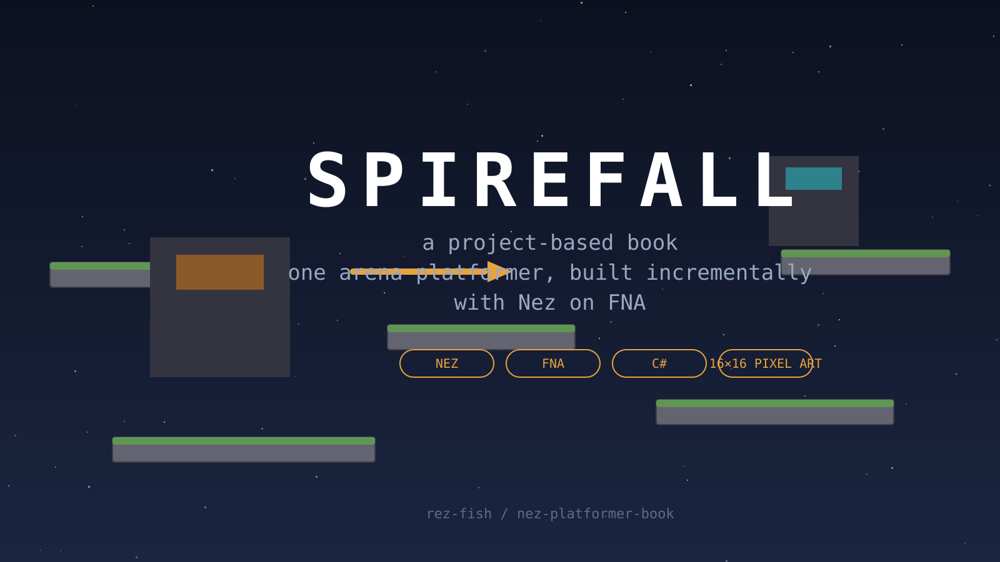

# Spirefall

A project-based book about building a game the way games are actually built: one working slice at a time. Over fourteen chapters you take a blank window to a complete pixel-art arena platformer — an archer with Celeste-grade movement, tilemap arenas, enemies, juice, and a local versus mode — using **Nez on FNA**, in C#.

## Who this is for

Experienced programmers who are new to C# and to game development. General programming basics are skipped; C# idioms and XNA/FNA concepts are explained the first time they appear. If you've shipped a web backend but never a game loop, you're the reader.

## How to use this book

Each chapter builds directly on the previous chapter's code — there is no "download the starter project and ignore how it got here." Every chapter follows the same shape:

1. **Where we are** — a 2–3 sentence recap of the running game.
2. **Concepts and reference** — the ideas and APIs you need, with minimal snippets that demonstrate the API only.
3. **Exercises** — 5–10 ordered tasks, easiest first, each with three tiers of hints (*nudge*, *bigger hint*, *near-solution*).
4. **Checkpoint** — what the game looks like and does now, and how to run it.

Full solutions live in `/solutions/chNN` in the repository — never in the chapter text. If you're stuck, read the solution, then close it and write it yourself. Chapter start snapshots live in `/code/chNN-start`.

## What you'll build

- **Chapters 1–3:** toolchain, the game loop, and Nez's Scene/Entity/Component model with pixel-perfect rendering.
- **Chapters 4–6:** game-feel movement — acceleration, variable jumps, coyote time, buffering, collisions, wall slide, wall jump, dash.
- **Chapters 7–10:** tilemap arenas, camera and juice, title/pause flow with Gum UI, audio.
- **Chapters 11–14:** arrows and scoring, enemy AI, local versus multiplayer, and shipping on Windows.

## Before you start

You need a Windows machine, the .NET 8 SDK, and the FNA native libraries ("fnalibs"). Chapter 1 walks through all of it. The book pins exact dependency versions; check the chapter if yours differ.

Art is placeholder programmer-art by design (generated scripts are in the repo) — bring your own 16×16 tiles whenever you're ready. The mechanics don't care what the pixels look like.

Ready? [Chapter 1: Toolchain and first window](ch01-toolchain.md).
